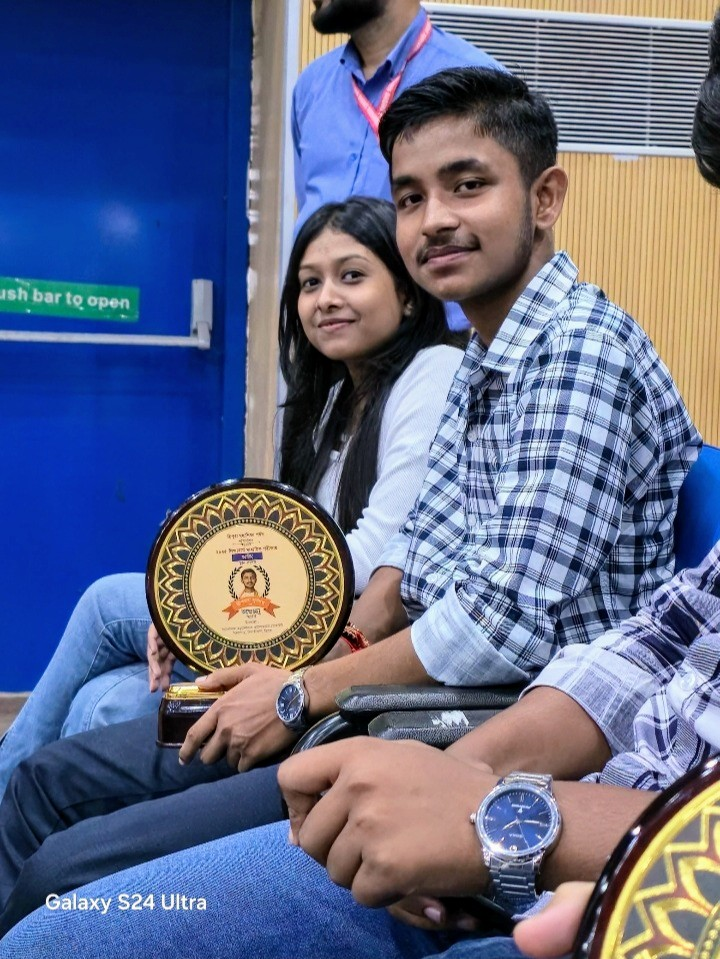
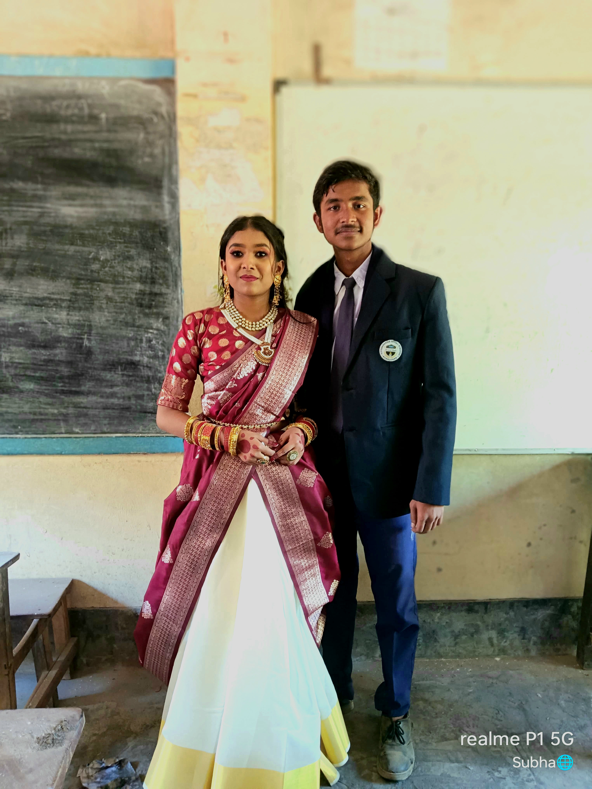
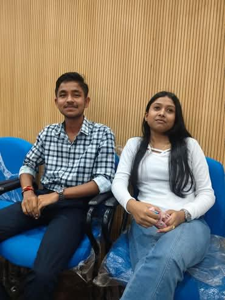
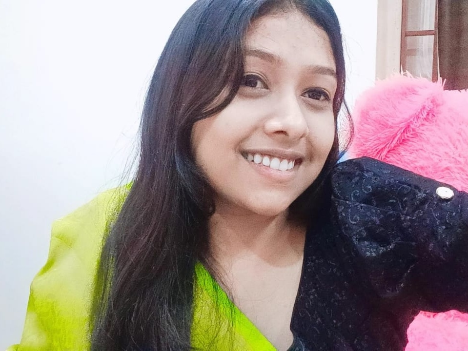

<!DOCTYPE html>
<html lang="en">
<head>
  <meta charset="UTF-8" />
  <meta name="viewport" content="width=device-width, initial-scale=1.0" />
  <title>For Amrika ❤️</title>

  <!-- Google Fonts -->
  <link rel="preconnect" href="https://fonts.googleapis.com">
  <link rel="preconnect" href="https://fonts.gstatic.com" crossorigin>
  <link href="https://fonts.googleapis.com/css2?family=Playfair+Display:wght@500;700&family=Patrick+Hand&family=Poppins:wght@300;400;600&display=swap" rel="stylesheet">

  
</head>
<body>

  
<strong>For Amrika ❤️</strong>

  <!-- HOME -->
  <section class="page active" id="home">
    <h1>Amrika ❤️</h1>
    <h2>My wiffeyyy, my favorite person</h2>

    

      
Your eyes have a magic I fall for every time.

      
With you beside me, everything feels right.

      
This smile is my favorite sight.

      
Moments with you are my safest place.

    

    

      
This little website is made just for you — a soft place filled with love, memories, and tiny pieces of my heart. Take your time, wiffeyyy 💕

      

        <button onclick="go('letter')">Read My Letter 💌</button>
        <button onclick="go('why')">Why I Love You 💖</button>
        <button onclick="openSecret()">Secret 💗</button>
      

    

    <footer>Made with love by Dipjoy</footer>
  </section>

  <!-- SECRET OVERLAY -->
  

    

      <h2 style="font-family:'Playfair Display',serif;margin-top:0">Unlock my secret 💞</h2>
      
Only my wiffeyyy knows the word.

      <input id="secretInput" placeholder="Enter the secret emoji" style="width:100%;padding:12px 14px;border-radius:14px;border:0;margin:10px 0" />
      
Hint: enter the emoji that we used to confess our love in crowd.

      

        <button onclick="checkSecret()">Unlock ✨</button>
        <button onclick="closeSecret()">Close</button>
      

      
Hmm… try again 💭

    

  

  <!-- SECRET PAGE -->
  <section class="page" id="secret">
    <h1>Just Between Us 💗</h1>
    

      

        If you’re reading this, it means you unlocked a piece of my heart.
        I don’t say this lightly — you are my safe place, my calm, my favorite thought.
        I want a thousand small moments with you, and a lifetime of choosing you.
          
        The kisses of this Valentine's Day is remaining the pending ones, you have to give me the kisses with interest💋  Forever yours, Dipjoy 💖
      

      
<button onclick="go('home')">Back Home 🏡</button>

    

  </section>

  <!-- LETTER -->
  <section class="page" id="letter">
    <h1>A Letter for You 💌</h1>
    

      
My dearest Amrika,  
      You have a way of turning ordinary moments into something gentle and bright. Your smile feels like home, and your presence brings a quiet peace. With you, laughter comes easily — and even silence feels warm.  
      I choose you, again and again, in the little ways and the big ones. Always yours, Dipjoy 💖

      
<button onclick="go('home')">Back Home 🏡</button>

    

  </section>

  <!-- WHY -->
  <section class="page" id="why">
    <h1>Why I Love You 💖</h1>
    

      
Because you’re kind and real. Because your laughter makes everything lighter. Because being with you feels natural and safe. And mostly… because you are you. My wiffeyyy ❤️

      
<button onclick="go('home')">Back Home 🏡</button>

    

  </section>

  <!-- Music (optional: add music.mp3 next to index.html) -->
  
<button onclick="toggleMusic()">tap💗</button>

  <audio id="bgm" loop autoplay muted playsinline src="music.mp3"></audio>

  
</body>
</html>
